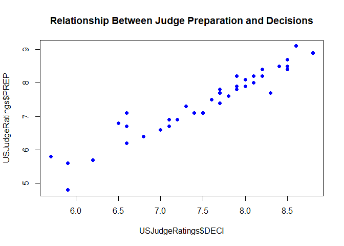

README - Preprocessing markdown examples
================
John Leonard
<br/>September 11, 2022

# Preprocessing markdown files

This folder contains examples for pre-processing markdown files.
Programming language code (e.g., python, r, mermaid, etc.) and results
(e.g., program output, graphics, etc.) can be embedded and EXECUTED
within markdown files by using a preprocessor. The resulting Markdown
.md file will be “GITHUB” ready, and will look pretty when viewed on
GITHUB.

In this folder, I’m using the “R” programming language. The original
code is stored in an “R-markdown” file, that is, a file with the “.Rmd”
extension. As I improve and iterate my code, I convert the “.Rmd” files
into regular “.md” by feeding them to R. The entire process is
orchestrated through the Makefile.

The Makefile contains instructions for creating GITHUB ready markdown
.md files AND instructions for creating PDF versions of the files. Look
at the .Rmd files, then review the similiarly named .md, .html, and .pdf
files.

The workflow is simple:

1.  Edit the .Rmd file.
2.  “make” the .md file. Pandoc will process the .Rmd file and create a
    .md file, an .html file, and a .pdf file.
3.  Review the results by viewing the .html or .pdf, repeating steps 1-3
    until you’re happy, done, or both.
4.  Add and commit any changes to the repo.
5.  Push the changes back to your repo.

## Getting started

To get started, you need to install:

1.  “R” programming language
2.  “make” utility
3.  Pandoc document processing utility
4.  pdflatex or xelatex text processing utility

## Installing the software

The ABSOLUTELY BEST utility to learn is CHOCOLATEY. This is a package
manager, very similar to APT (on Ubuntu) or BREW (on Mac). A package
manager lets you install software directly from the command line without
answering all those crazy questions. AND, if you don’t like what you
installed you can unstally it.

See: [Chocolatey home page](https://chocolatey.org/) and the [command
line install docs](https://docs.chocolatey.org/en-us/choco/setup).

## Equations in the markdown file

Here is an example of LaTex code

$\prod_{x = a}^{b} f(x)$

Here is a
[URL](https://bookdown.org/dalzelnm/bookdown-demo/mathematical-notation-in-r.html)
to learn more.

## Python code in the markdown file

``` python
# This is a listing of the code to run. The results will be printed below.
# Listing of code prior to running can be disabled.
print("Hello from Python")
```

    ## Hello from Python

Here is the
[URL](https://bookdown.org/yihui/rmarkdown-cookbook/eng-python.html) to
learn more.

## R code and graphics in a markdown file

``` r
data(USJudgeRatings)
plot(USJudgeRatings$DECI, USJudgeRatings$PREP,
     main="Relationship Between Judge Preparation and Decisions",
     pch=16, col="blue")
```

<!-- -->

Here is the
[URL](https://bookdown.org/ejvanholm/WorkingWithData/r-markdown-guide.html)
to learn more.
